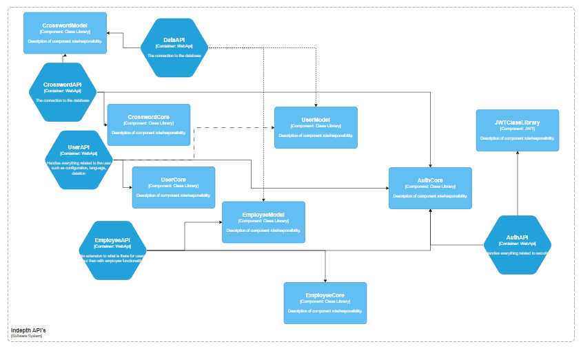
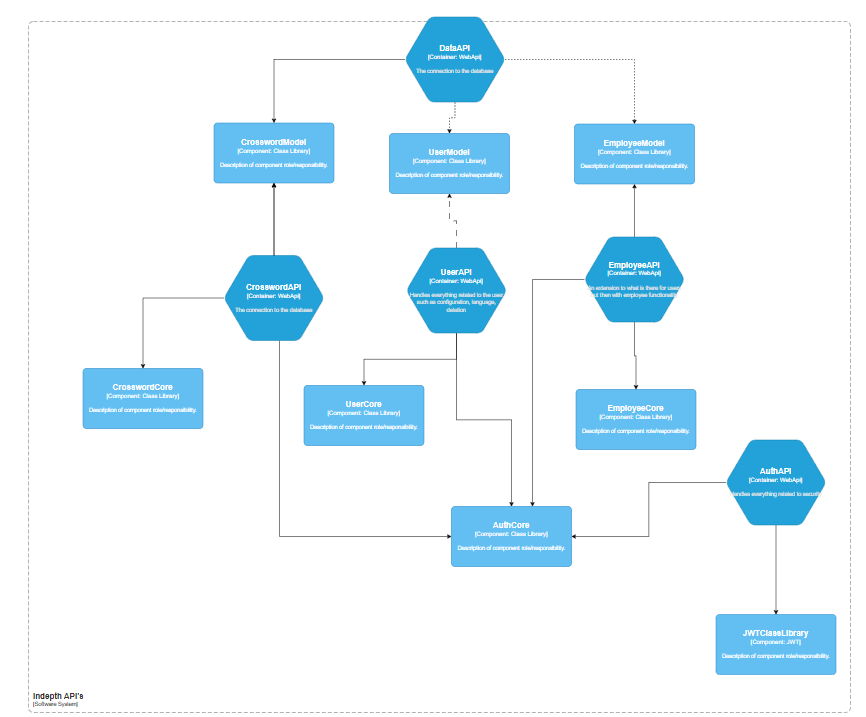

# The Global Architecture

I follow the aspire architecture with my own projects attached to it.  
The aspire architecture exist out of:

- AspireHost
- Web project
- WebAPi project
- ServiceDiscovery

These are required to run the project. With furthermore it doing background stuff that is not necessarily connected to anything like setting up telemetry, HealthChecks and other services that every project will need. Thus it will not be added to the global architectural view but it's something you need to keep in mind.

With this in mind you can see the following where I added all the planned api projects with the frontend and database connected:

As you can see it's very global like how it should be further in this document you will see the deeper architecture from each of these.

## Explanation of how design came to be

I first started with looking at how the aspire project looked at first glance. The AppHost project and ServiceDiscovery project where the main components that hold everything together. While the Web project is for the frontend I left this as I didn't want to keep everything together and have aspire support and integrations with my project.  
The WebApi project is about using this to connect to the other components (webApi) projects that the project should have which is inline with the microservices architecture.
While I didn't want to have this be the bottleneck for throughput and doesn't need to know every API service.

So, I remade it so a frontend can connect to which services it needs (see picture) and nothing more. If one of these fail then the others still can be used for what is necessary.  
There is no typical name for this but I think its more inline with modular microservices as I have different modules that can only do what they are scoped to and you still connect to them via API calls and can be changed for a different one. For instance now I have a postgres database but it can easily be changed to a Microsoft SQL database in principle.

The DataBus is there for the instance that you need to save a big puzzle or a lot of calls to the database it should handles these requests and actions without giving downtime.  
As otherwise you can have something happened before the other or needs to wait before something big is done (the large crossword).

The modules of: `Crossword`, `User`, `Employee`, `Auth` all handle their own tasks.  
`Crossword` is there for everything related to the crossword like generation, playing, multiplayer playing.  
The `User` is then for the user only like settings, language, multiplayer connection and tournament.  
`Employee` is just the `User` plus extra's like handling of users, organize tournament and crosswords, banning of people and possible emailing.  
`Auth` is both the most simple module and the difficult one as almost every request has something to do with it. The login and passwords will be handled by this module only. Although it's more vague and should sometimes be executed before the other request and do something based on it.

## In-depth  Architecture

See the following for the more in-depth plan on how the architecture will be. Not everything is mentioned as that would be to small for it. With this you can get an idea on how it will look like all the 'core' things will have all the logic while 'model' projects will be used by data to handle the various data models and use it for the database.

It seems a bit messy but I find this a bit better then the following alternative. As it follows the global one more.

The base that I have a core project is to keep the main logic out of the api and so it can be swapped out by other class library projects that take the API over if needed.  
While the 'model' projects are determined and when changed will almost definitely create issues for both data and Core projects even possibly API but that shouldn't be called for it. Furthermore, it has almost no logic only what it needs to work efficiently like overriding the `ToString` method for example to get a functional string instead of object.
