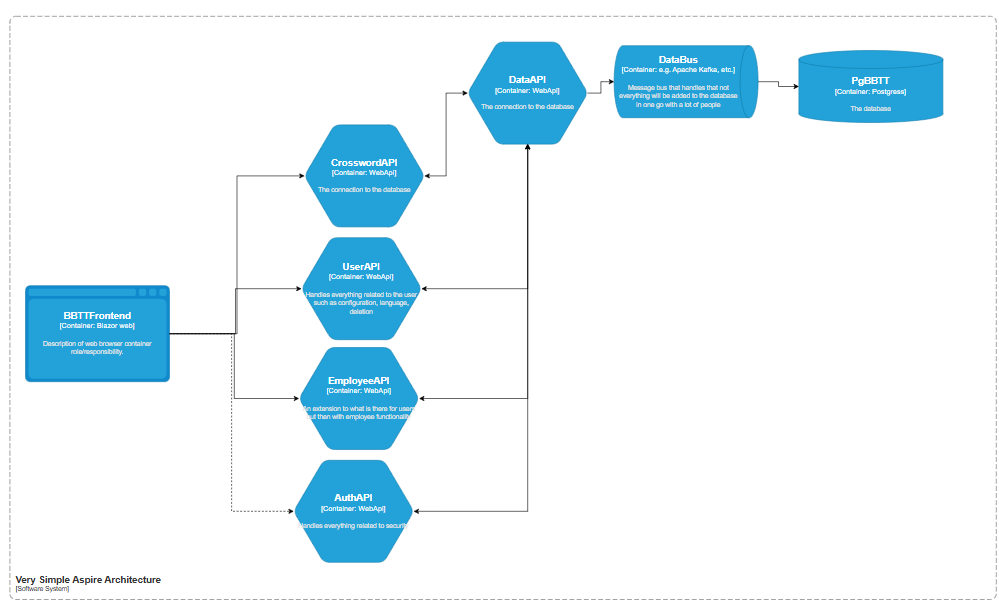

# The Global Architecture

I follow the aspire architecture with my own projects attached to it.  
The aspire architecture exist out of:

- AspireHost
- Web project
- WebAPi project
- ServiceDiscovery

These are required to run the project. With furthermore it doing background stuff that is not necessarily connected to anything like setting up telemetry, HealthChecks and other services that every project will need. Thus it will not be added to the global architectural view but it's something you need to keep in mind.

With this in mind you can see the following where I added all the planned api projects with the frontend and database connected:

As you can see it's very global like how it should be further in this document you will see the deeper architecture from each of these.

