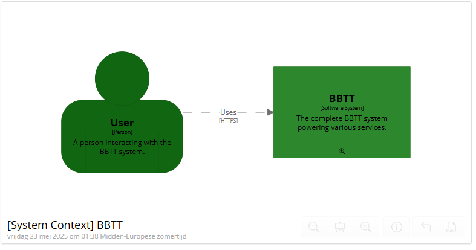
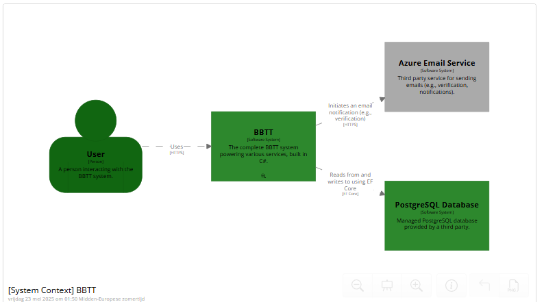
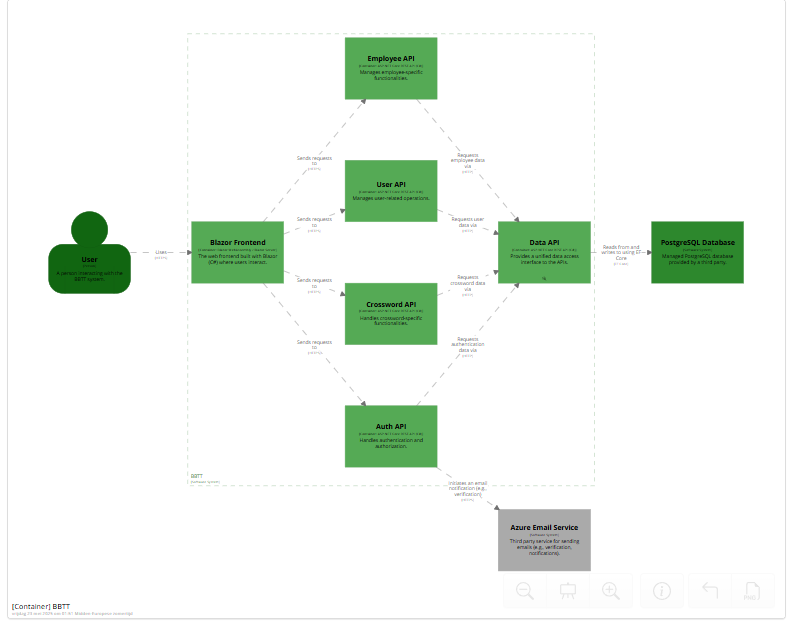
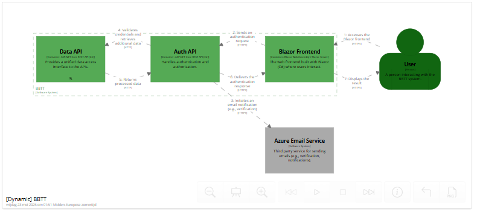

# C4 Diagram

## System Context

The System Context diagram represents the highest level of the C4 model, focusing on the main actors and their interactions with the Tower of Tongues project. At this level, the diagram typically shows how users (such as end users and administrators) interact directly with the system as a whole, without detailing internal components.

In this context, the relationship is straightforward:  
**User → Project**

This means users access the Tower of Tongues system to perform their tasks, and the system responds as a single, unified application.

---

## System Context with 3rd Party Integrations

When third-party services are introduced, the context expands to show how the system itself interacts with external providers. The diagram now illustrates a chain of interactions:  
**User → Project → Third Party**

Here, users still interact with the Tower of Tongues system, but the system, in turn, communicates with external services (such as azure email or postgres image) to fulfill user requests or enhance functionality. This highlights the system’s dependencies and integration points with the broader ecosystem.

---

## Container Diagram

The container diagram shows the relationship between the main parts of the Tower of Tongues system. The **Frontend** (user interface) communicates with several logic APIs, such as **CrosswordAPI**, **UserAPI**, **EmployeeAPI**, and **AuthAPI**. Each of these APIs handles a specific area of business logic. These APIs, in turn, connect to the **DataAPI**, which is responsible for all database actions. This structure separates concerns, making the system modular and easier to maintain.

---

## Login Flow

the Login Flow diagram offers a step-by-step visualization of the authentication process: the user accesses the frontend, which sends authentication requests to the AuthAPI. The AuthAPI coordinates with the DataAPI to verify user credentials and with Azure Email Service to send verification codes or notifications.
