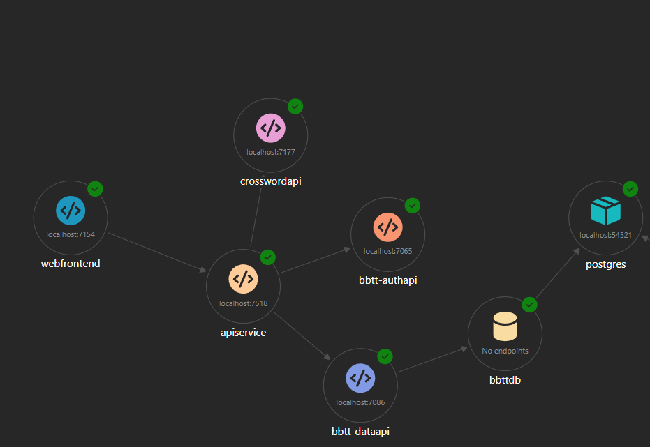

# The API Gateway

## What is an API Gateway

An API gateway is a fully managed service that makes it easier for developers to create, publish, maintain, monitor, and secure APIs at almost any scale. (Adetunji, 2024)

APIs enable digital experiences, simplify application integration, underpin new digital products, and make data and services reusable and universally accessible. With the proliferation and increasing dependency on APIs, organizations need to manage them as first-class assets throughout their lifecycle. (Dlepow, n.d.), Dlepow (n.d.)

### Short introduction

I need an API gateway to fulfill the need of a central point which can connect to diverse modules in my project to handle the requests and also giving th possibility to have one point that needs to be made secure. Although this brings in a single point of failure that can't be evaded with implementing it but it will also bring benefits like the security and not needing to handle various endpoint links.

### How it works and what it can do

As of Adetunji (2024) an API gateway works in the matter that it acts like an communicator between the various modules.  
Another thing is that does request validation like checking the structure of the request and validating data types.
So it also handles the authorization and authentication of the requests. It can also handle rate limiting of a user or service can make within a specified time frame.  
Next thing it can do is request routing and is one of the main points why you want one as it can send request to a specified module.

### Challenges

A challenge that can be brought by the API is that you have a hard limited on RPS (request per second) following  Adetunji (2024) which results in a loss of flexibility that the current project has in terms of RPS.  

Another challenge following Jackson and Goodwin (2025) is that you will get scalability issues as it has a limited amount of RPS and every user is connected to this module.  
Which then creates the following challenge that it creates a single point of failure. Although for this project not that important right now but there can become a Gateway dependency because it can be expensive and time-consuming to move to another vendor.

### Different kind of gateways

You can have different kinds of API gateways I will focus on a few here below. I got the from GeeksforGeeks (2023) which specifies different kinds of API gateways.

#### Reverse Proxy API Gateway

This is a valid type of API gateway that acts as a reverse proxy, forwarding client requests to backend services. The main benefit of this one is security with SSL/TLS termination, DDoS protection, and WAF (Web Application Firewall) integration.Load balancing can distribute incoming requests across multiple backend servers for balancing.  
They can cache responses to reduce the load on backend servers and improve response times.  
But it may not be suitable for more complex API routing and transformations.

#### HTTP/HTTPS API Gateway

This type of API gateway operates over HTTP or HTTPS protocols, acting as a single entry point for all client requests to backend services. The main benefits include support for RESTful APIs, easy integration with web clients, and the ability to enforce security policies such as authentication and authorization. It can also handle request/response transformations and rate limiting.  
However, it may not be suitable for applications requiring real-time, bidirectional communication.

#### WebSockets API Gateway

A WebSockets API Gateway is designed to manage persistent, full-duplex communication channels between clients and servers, which is essential for real-time applications like chat or live updates. The main benefit is enabling low-latency, two-way communication.  
A limitation is that it may require more complex infrastructure and is not always supported by all clients or backend services.

#### Cloud API Gateway

Cloud API Gateways are managed by cloud providers and offer seamless integration with other cloud services, scalability, and simplified deployment. The main benefits are automatic scaling, built-in security features, and reduced operational overhead.  
A limitation is potential vendor lock-in and less control over customization compared to self-hosted solutions.

#### Microservices API Gateway

This gateway is tailored for microservices architectures, aggregating multiple service endpoints into a single API and handling cross-cutting concerns like authentication, logging, and rate limiting. The main benefit is simplifying client interactions with complex microservices systems.  
However, it can add complexity to the system and may become a bottleneck if not properly managed.

#### Custom API Gateway

A Custom API Gateway is built to meet specific business or technical requirements not addressed by standard solutions. The main benefit is flexibility and the ability to tailor features to exact needs.  
The downside is increased development and maintenance effort, as well as potential scalability challenges.

### Conclusion: which kind is picked

Although  the custom API gateway would be the best I will focus on the Microservices API Gateway due to it simplifying the client interactions with the backend.

## How to implement API Gateway

You can implement the API gateway in the way of creating an API web application which you can use to create this gateway.  
Then with the project started you can create a program file that runs with starting of the application in this C# project module. In this you can specify how the requests will be handled. An example on how you can specify it is:

````C#
builder.Services.AddHttpClient<CrossWordApiClient>(client =>
{
    client.BaseAddress = new("https+http://crosswordapi");    
});
````

Where `CrosswordApi` is specified in the AppHost project with the precise name.

As an example of a microservice route you can specify in the program.cs file is:

````C#
app.MapGet("/about", () => "This is Microservice about endpoint! This is visible at the '/.../about' route!");

````

In the APIGateway you need to add in the AppSettings.json file:

````JSON
"ReverseProxy": {
    "Routes": {
      "route1": {
        "ClusterId": "cluster1",
        "Match": {
          "Path": "{**catch-all}"
        }
      },
      "adminRoute": {
        "ClusterId": "cluster2",
        "Match": {
          "Path": "/admin/{**catch-all}"
        },
        "Transforms": [
          {
            "PathRemovePrefix": "/admin"
          }
        ]
      }
    },
    "Clusters": {
      "cluster1": {
        "Destinations": {
          "destination1": {
            "Address": "http://microservice1",
            "Health": "http://microservice1/readiness"
          }
        }
      },
      //... other clusters
    }
    //.... rest of the file
````

In the program.cs file you also need to change some things like:

````C#
builder.Services.AddReverseProxy()
    .LoadFromConfig(builder.Configuration.GetSection("ReverseProxy"))
    .AddServiceDiscoveryDestinationResolver();

//.. rest of builder steps
var app = builder.Build();

app.MapReverseProxy();

// ... rest of your code
````

## Example of implemented gateway



## Conclusion

The api gateway is now implemented in the BBTT project the gateway is a good way for managing and securing communication between clients and backend services, especially in a microservices architecture.

After looking at multiple various types of gateways, the Microservices API Gateway was chosen for this project because it simplifies client interactions, centralizes cross-cutting concerns like authentication and logging, and streamlines request routing.  
It's also good to add for maintainability and preperation for future scalability as more services are added.

By implementing the API Gateway as described, the project benefits from improved security, and easier management of backend

## Sources

[Adetunji, D. (2024, September 10). What is an API Gateway and Why is it Useful?](https://www.freecodecamp.org/news/what-are-api-gateways/)  
[Dlepow. (n.d.). API gateway overview. Microsoft Learn.](https://learn.microsoft.com/en-us/azure/api-management/api-management-gateways-overview#related-content)  
[Jackson, G., & Goodwin, M. (2025, April 17). API gateway. What is an API gateway?](https://www.ibm.com/think/topics/api-gateway)  
[GeeksforGeeks. (2023, November 3). Different types of API gateways? GeeksforGeeks.](https://www.geeksforgeeks.org/system-design/different-types-of-api-gateways/)
